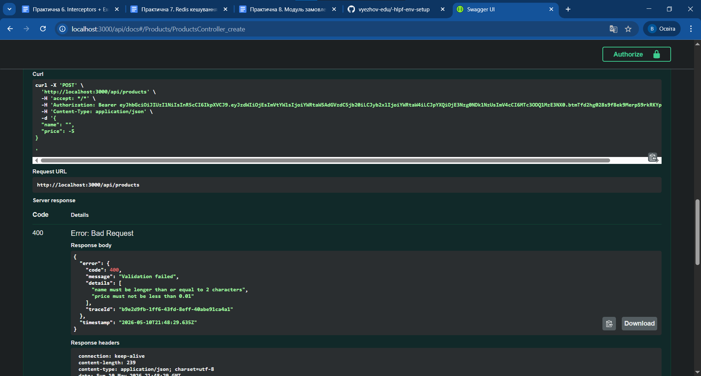

## Student
- Name: Єжов Вадим Олександрович
- Group: 232.1

## Практичне заняття №6 — Interceptors + Exception Filters + Swagger

### Структура репозиторію
```
.
├── src/
│   ├── auth/ ...
│   ├── users/ ...
│   ├── categories/ ...
│   ├── products/ ...
│   ├── common/
│   │   ├── enums/
│   │   │   └── role.enum.ts
│   │   ├── guards/
│   │   │   ├── jwt-auth.guard.ts
│   │   │   └── roles.guard.ts
│   │   ├── decorators/
│   │   │   ├── current-user.decorator.ts
│   │   │   └── roles.decorator.ts
│   │   ├── interceptors/
│   │   │   ├── logging.interceptor.ts
│   │   │   └── transform.interceptor.ts
│   │   ├── filters/
│   │   │   └── http-exception.filter.ts
│   │   └── pipes/
│   │   	└── trim.pipe.ts
│   ├── migrations/
│   ├── main.ts
│   └── app.module.ts
├── swagger-screenshot.png
├── Dockerfile
├── docker-compose.yml
└── README.md
```

### Запуск проекту
```bash
app-1  | [9:53:25 PM] Found 0 errors. Watching for file changes.
app-1  | 
app-1  | [Nest] 34  - 05/10/2026, 9:53:26 PM     LOG [NestFactory] Starting Nest application...
app-1  | [Nest] 34  - 05/10/2026, 9:53:26 PM     LOG [InstanceLoader] TypeOrmModule dependencies initialized +92ms
app-1  | [Nest] 34  - 05/10/2026, 9:53:26 PM     LOG [InstanceLoader] ConfigHostModule dependencies initialized +0ms
app-1  | [Nest] 34  - 05/10/2026, 9:53:26 PM     LOG [InstanceLoader] AppModule dependencies initialized +1ms
app-1  | [Nest] 34  - 05/10/2026, 9:53:26 PM     LOG [InstanceLoader] ConfigModule dependencies initialized +1ms
app-1  | [Nest] 34  - 05/10/2026, 9:53:26 PM     LOG [InstanceLoader] ConfigModule dependencies initialized +0ms
app-1  | [Nest] 34  - 05/10/2026, 9:53:26 PM     LOG [InstanceLoader] JwtModule dependencies initialized +0ms
app-1  | [Nest] 34  - 05/10/2026, 9:53:26 PM     LOG [InstanceLoader] CacheModule dependencies initialized +11ms
app-1  | [Nest] 34  - 05/10/2026, 9:53:26 PM     LOG [InstanceLoader] TypeOrmCoreModule dependencies initialized +51ms
app-1  | [Nest] 34  - 05/10/2026, 9:53:26 PM     LOG [InstanceLoader] TypeOrmModule dependencies initialized +1ms
app-1  | [Nest] 34  - 05/10/2026, 9:53:26 PM     LOG [InstanceLoader] TypeOrmModule dependencies initialized +0ms
app-1  | [Nest] 34  - 05/10/2026, 9:53:26 PM     LOG [InstanceLoader] TypeOrmModule dependencies initialized +0ms
app-1  | [Nest] 34  - 05/10/2026, 9:53:26 PM     LOG [InstanceLoader] UsersModule dependencies initialized +0ms
app-1  | [Nest] 34  - 05/10/2026, 9:53:26 PM     LOG [InstanceLoader] AuthModule dependencies initialized +2ms
app-1  | [Nest] 34  - 05/10/2026, 9:53:26 PM     LOG [InstanceLoader] CategoriesModule dependencies initialized +0ms
app-1  | [Nest] 34  - 05/10/2026, 9:53:26 PM     LOG [InstanceLoader] ProductsModule dependencies initialized +1ms
app-1  | [Nest] 34  - 05/10/2026, 9:53:26 PM     LOG [RoutesResolver] AppController {/}: +31ms
app-1  | [Nest] 34  - 05/10/2026, 9:53:26 PM     LOG [RouterExplorer] Mapped {/, GET} route +5ms
app-1  | [Nest] 34  - 05/10/2026, 9:53:26 PM     LOG [RoutesResolver] CategoriesController {/api/categories}: +0ms
app-1  | [Nest] 34  - 05/10/2026, 9:53:26 PM     LOG [RouterExplorer] Mapped {/api/categories, GET} route +1ms
app-1  | [Nest] 34  - 05/10/2026, 9:53:26 PM     LOG [RouterExplorer] Mapped {/api/categories/:id, GET} route +2ms
app-1  | [Nest] 34  - 05/10/2026, 9:53:26 PM     LOG [RouterExplorer] Mapped {/api/categories, POST} route +1ms
app-1  | [Nest] 34  - 05/10/2026, 9:53:26 PM     LOG [RouterExplorer] Mapped {/api/categories/:id, PATCH} route +1ms
app-1  | [Nest] 34  - 05/10/2026, 9:53:26 PM     LOG [RouterExplorer] Mapped {/api/categories/:id, DELETE} route +0ms
app-1  | [Nest] 34  - 05/10/2026, 9:53:26 PM     LOG [RoutesResolver] AuthController {/auth}: +0ms
app-1  | [Nest] 34  - 05/10/2026, 9:53:26 PM     LOG [RouterExplorer] Mapped {/auth/register, POST} route +1ms
app-1  | [Nest] 34  - 05/10/2026, 9:53:26 PM     LOG [RouterExplorer] Mapped {/auth/login, POST} route +0ms
app-1  | [Nest] 34  - 05/10/2026, 9:53:26 PM     LOG [RoutesResolver] ProductsController {/api/products}: +0ms
app-1  | [Nest] 34  - 05/10/2026, 9:53:26 PM     LOG [RouterExplorer] Mapped {/api/products, GET} route +1ms
app-1  | [Nest] 34  - 05/10/2026, 9:53:26 PM     LOG [RouterExplorer] Mapped {/api/products/:id, GET} route +1ms
app-1  | [Nest] 34  - 05/10/2026, 9:53:26 PM     LOG [RouterExplorer] Mapped {/api/products, POST} route +0ms
app-1  | [Nest] 34  - 05/10/2026, 9:53:26 PM     LOG [RouterExplorer] Mapped {/api/products/:id, PATCH} route +0ms
app-1  | [Nest] 34  - 05/10/2026, 9:53:26 PM     LOG [RouterExplorer] Mapped {/api/products/:id, DELETE} route +1ms
app-1  | [Nest] 34  - 05/10/2026, 9:53:26 PM     LOG [NestApplication] Nest application successfully started +3ms

```

### Swagger UI
http://localhost:3000/api/docs



### Формат успішної відповіді
```json
{
  "data": {  "id": 4,
    "name": "MacBook Air M4",
    "description": null,
    "price": 1299.99,
    "stock": 25,
    "isActive": true,
    "createdAt": "2026-05-10T21:55:13.706Z",
    "updatedAt": "2026-05-10T21:55:13.706Z" },
  "statusCode": 200,
  "timestamp": "2025-01-15T10:30:00.000Z"
}
```

### Формат помилки
```json
{
  "error": {
    "code": 400,
    "message": "Validation failed",
    "details": [
      "name must be longer than or equal to 2 characters",
      "price must not be less than 0.01"
    ],
    "traceId": "49b83179-605d-44cc-98b8-d22ec925b9d4"
  },
  "timestamp": "2026-05-10T21:56:25.038Z"
}
```

### Приклад логів (LoggingInterceptor)
```text
app-1       | [Nest] 34  - 05/10/2026, 10:00:09 PM     LOG [HTTP] GET /api/products — 200 — 19ms
app-1       | [Nest] 34  - 05/10/2026, 10:00:09 PM     LOG [HTTP] GET /api/products — 200 — 20ms
```

### Тест помилки з traceId
```text
{"error":{"code":404,"message":"Product #999 not found","traceId":"c6b4399c-0a3a-4bf2-9cdf-b36817333f9d"},"timestamp":"2026-05-10T22:00:55.124Z"}
```
